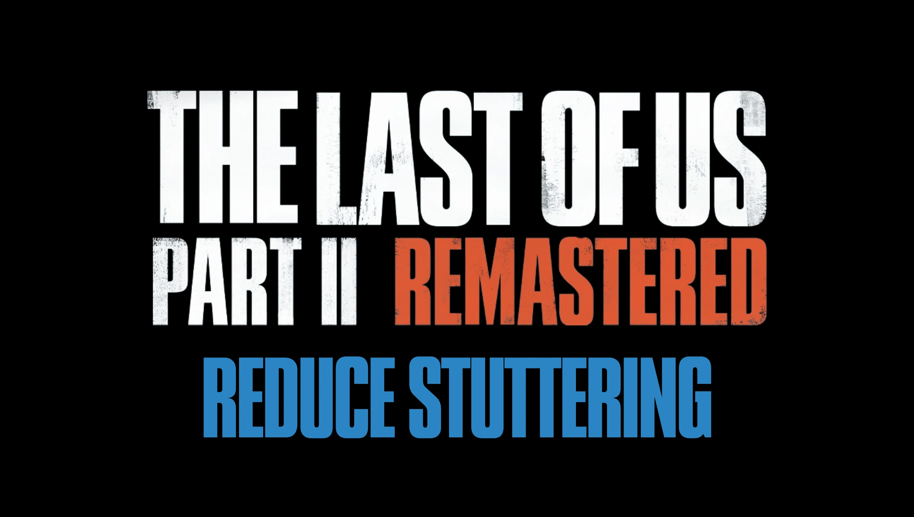

  

<h1 align="center">Reduce shader compilation stutter</h1>

  <strong>Optimization mod for The Last of Us Part II</strong>

  Recompiles the game's executable files to run with the latest available version of Microsoft's DirectX Shader Compiler, implementing the latest patches and fixes, potentially leading to less stuttering and improved stability.

---

## 📥 Downloads

> **[NOTICE]**  
> Source code is not uploaded to this repository, it only offers compiled releases as an alternative to NexusMods.

The mod can be downloaded from either of the following platforms:
* **[GitHub Releases](https://github.com/ShyVortex/tlou2-reduce-stuttering/releases)**
* **[NexusMods](https://www.nexusmods.com/thelastofuspart2/mods/69)**

---

## ⚠️ Compatibility

> **[IMPORTANT]**  
> * This mod **only** works with the **Steam** version of the game.
> * Epic Games version makes the game fail to launch. **DO NOT INSTALL.**
> * Since version **1.8.0**, Windows 10 support has been marked as deprecated. Users of Windows 10 should stick to previous versions (**1.7.1 or below**).
> * Official Linux support is currently in beta, added since version **1.9.0b2**.

---

## 🛠️ Current Branch

| Status | Version | Release |
| :----- | :------ | :------- |
| 🟢 Stable | 1.9.0 | [Download](https://github.com/ShyVortex/tlou2-reduce-stuttering/releases/tag/v1.9.0) |

---

## Installation

1. Drag and drop all files from the release archive into the game's main folder.
2. A `backup` folder is included in this repository from TLOU2's latest PC patch (1.6.10721.105) in case something doesn't work correctly and you need to restore them.

---

## Support

If you like this mod and wish to support my work, you may consider buying me a coffee on [**Ko-fi**](https://ko-fi.com/shyvortex).
Thank you!

## License
This project is distributed under the [CC-BY-NC-ND 4.0 License](https://github.com/ShyVortex/tlou2-reduce-stuttering/blob/main/LICENSE.md).  
This license was chosen to prevent people from redistributing the edited files under a paywall.

### Legal Disclaimer
**"The Last of Us"** and **"The Last of Us Part II"** are properties of Naughty Dog and Sony Interactive Entertainment.  
The author of this repository is not affiliated with, associated with, or endorsed by Naughty Dog or Sony Interactive Entertainment.  
Backup files are included in this repository solely to facilitate users in rolling back to the original files in case of any issues with their systems.
